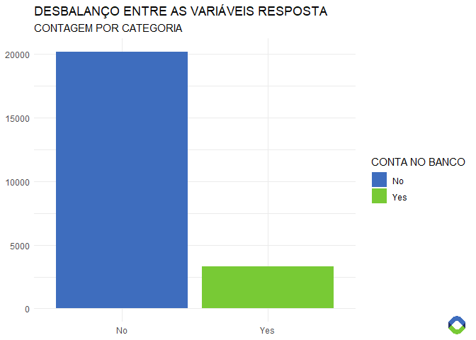

## Financial Inclusion in Africa

Esse repositório contém códigos do desafio Zindi Africa. Aqui, é
descrito todo o processo para chegar no resultado final. Os códigos todo
estão no arquivo `CaseAnaliseDados.R`.

O desafio foi feito na linguagem `R`. As etapas do processo são:

  - Análise exploratória dos dados
  - Balanceamento de variáveis
  - Modelagem
  - Resultados

## Importações

Os pacotes `data.table`e `tidyverse` (que inclui `dplyr`, `tidyr` e
outros) serão utilizados para as operações de *data wrangling*. Para as
visualizações, utilizarei o `ggplot2` (incluído no `tidyverse`) e
`magick`; enquanto que os pacotes `caret`, `pROC` e `xgboost` serão
utilizados na parte de *machine learning*.

Os dados

## Análise Exploratória dos Dados

<!-- -->

Note that the `echo = FALSE` parameter was added to the code chunk to
prevent printing of the R code that generated the plot.
