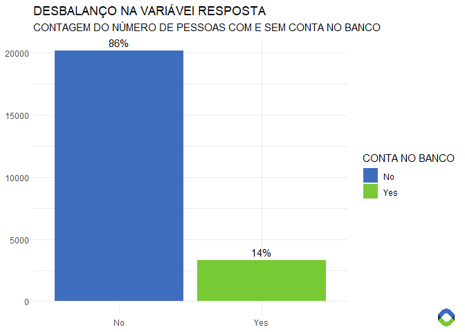
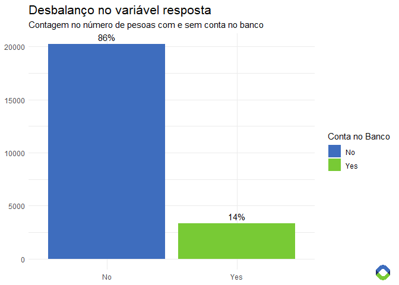

## Introduçao

Esse repositório contém códigos do desafio Zindi Africa. Aqui, é
descrito todo o processo para chegar no resultado final. Os códigos
completos do estudo estão no arquivo `CaseAnaliseDados.R`. Os dados,
obtidos de
<https://zindi.africa/competitions/financial-inclusion-in-africa/data>
estão na pasta `data`.

O objetivo é fazer um modelo que identifique quais pessoas possuem conta
no banco, correspondente a variável `bank_account`.

O desafio foi feito na linguagem `R` e as etapas do processo são:

  - Análise exploratória dos dados
  - Balanceamento de variáveis
  - Modelagem
  - Resultados

## Importações

Os pacotes `data.table` e `tidyverse` (que inclui `dplyr`, `tidyr` e
outros) serão utilizados para as operações de *data wrangling*. Para as
visualizações, utilizarei o `ggplot2` (incluído no `tidyverse`) e
`magick`; enquanto que os pacotes `caret`, `pROC` e `xgboost` serão
utilizados na parte de *machine learning*.

Os dados originais estão divididos entre treino e teste, sendo que o
teste não contém a variável resposta.

## Análise Exploratória dos Dados

``` r
names(train)
```

    ##  [1] "country"                "year"                   "uniqueid"              
    ##  [4] "bank_account"           "location_type"          "cellphone_access"      
    ##  [7] "household_size"         "age_of_respondent"      "gender_of_respondent"  
    ## [10] "relationship_with_head" "marital_status"         "education_level"       
    ## [13] "job_type"

<!-- -->

Há um desbalanço na variável resposta. Isso deve ser levado em
consideração na hora de treinar o modelo, pois datasets desbalanceados
podem influenciar no resultado do modelo.

<!-- -->

Os países apresentam taxas diferentes de pessoas com contas bancárias.

## Modelagem

O primeiro passo a ser feito é rodar um modelo de *machine learning* e
vermos os resultados iniciais obtidos, para então tomarmos a decisão de
que caminho seguir. Como não temos a variável resposta no dataset de
teste, iremos criar um dataset de validação a partir do dataset de
treino, que ficará de fora do treinamento do nosso modelo, para que
possamos avaliar como ele está performando.

O pacote `caret` tem uma função que facilita o processo de dividir o
dataset de maneira distribuida como o dataset original. 75% do dataset
original permaneceu no dataset de treino, e 25% ficou separado no de
validação.

``` r
trainIndex <- createDataPartition(train$bank_account, p = .75, 
                                  list = FALSE, times = 1)

validation <- train[-trainIndex]
train <- train[trainIndex]
```

Para treinar nosso primeiro modelo, utilizaremos a metodologia *Random
Forest*, modelo não-paramétrico que se adapta bem a diversos tipos de
dataset. Ele utiliza apenas um hiperparâmetro, o `mtry`. Uma regra de
bolso é utilizar a raiz quadrada do número de variáveis do dataset para
o `mtry`. Também utilizaremos o método de *Cross Validation*.

``` r
trcontrol = trainControl( method = "cv",
                          number = 5,  
                          allowParallel = TRUE,
                          verboseIter = TRUE )

mtry <- sqrt(ncol(train[, -'bank_account', with=F]))
tunegrid <- expand.grid(.mtry=mtry)

rf_model <- train(x = train[, -'bank_account', with=F], 
                  y = y_train,
                  trControl = trcontrol,
                  tuneGrid = tunegrid,
                  method = "rf")
```
